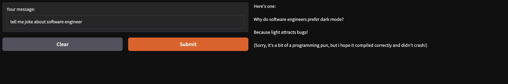
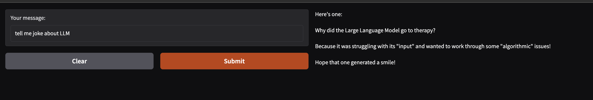

# Joke_assitant_LLM
An Joke Assistant LLM built based on Ollama LLM

## Steps
- Install Ollama Locally in your machine
- Run `ollama serve` or `ollama run llama3.2`
- Run the Main File `python ${filename}` which has gradio in it
- Using Gradio, we can get the request and response of chat interface. 

##Sample

